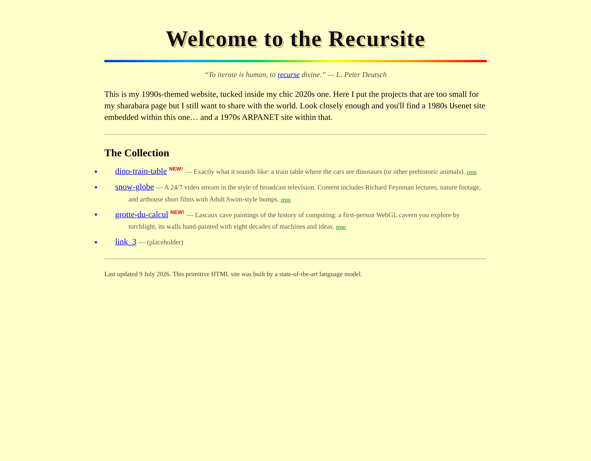

# the recursite

A 1990s-themed website tucked inside a 2020s one — the back room where the small
projects live, the ones too little for the front page but that I still want to share
with the world. Live at <https://recursite.brezgis.com>.



Built (deliberately) in the style of a 1994–96 academic / government "open-file report":
Times New Roman, a pale-yellow background, a CSS-reincarnated rainbow divider, classic
blue hyperlinks, and a fake Windows 95 pop-up window. Static HTML, no build step, no
framework — every page hand-authored.

## Turtles all the way down

The 1990s are only the top layer.

- Hidden in the front page is a door to **brezvax**, a 1984 Usenet site: a
  green-phosphor terminal with a guest login, a newsreader, a mailbox, and a shell.
  Every article is verbatim from Henry Spencer's utzoo tape archive — kremvax and
  all — with only the machine itself invented.
- Hidden in brezvax's shell is a number that should have been disconnected years ago
  (`tip arpa`). It answers: a 1977 ARPANET TIP printing onto fanfold paper, with
  SYSTAT, a host table, RFCs, and an original ADVENT miniature.
- Logging out of 1977 climbs back up to the present. (Strictly speaking that makes
  this a cycle, not a recursion. Shh.)

## Easter eggs

- Click **"recurse"** in the epigraph to open `recursion.exe` — a slideshow of recursion comics.
- Click **"Recursite"** in the title to expand it into its own definition, forever.
- View source for a hidden Niklaus Wirth quote.
- The door to 1984 is one letter set in the wrong typeface.

## Running locally

```
git clone https://github.com/brezgis/recursite.git
cd recursite
python3 -m http.server 8000
```

then open <http://localhost:8000>. There is no build step; there is nothing to build.

## Comics

The `recursion.exe` slideshow features work by other artists, shown with attribution and
links back to each creator. See [comics/CREDITS.md](comics/CREDITS.md). If you're a
creator and would like your comic removed, please open an issue.

---

*This primitive HTML site was built by a state-of-the-art language model.*
